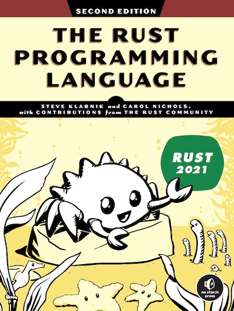

# Working through *The Rust Programming Language* (2ed)

My code while working through the book [*The Rust Programming Language*](https://nostarch.com/rust-programming-language-2nd-edition) (2ed).
There is an electronic version available [here](https://doc.rust-lang.org/stable/book/).
Other resources for learning Rust are available at the [Learn Rust](https://www.rust-lang.org/learn) website.

